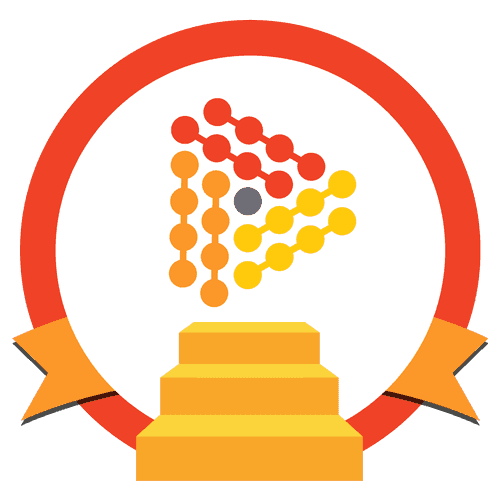

<html>
<!-- Badges session -->

  
  <!-- languages -->
  
  <!-- repo size -->
  
  <!-- licence MIT -->
  

<!--Banner session-->

  

<!--About session-->
<h1 align="center">JavaScriptGameDeveloper Digital Innovation One</h1>

Bootcamp JavaScript Game Developer da [Digital Innovation One](https://digitalinnovation.one/).
- 💻 13 cursos
- 🚀 8 desafios de projeto
- 🚀 6 desafios de código
- 0 lives

Aprenda de forma divertida a criar jogos com JavaScript para inciar a sua carreira em desenvolvimento front-end e se transformar em um dev de alto nível.

<h3>👨‍💻 Cursos</h3>

* Curso: Bem-vindo à DIO 
 Básico
肋 1 hrs

* Curso: Lógica de Programação Essencial 
 Básico
肋 4 hrs

* Curso: Introdução ao Git e ao GitHub 
 Básico
肋 5 hrs

* Curso: Introdução a Criação de Websites com HTML5 e CSS3 
 Básico
肋 6 hrs

* Curso: Conceitos de responsividade e experiência do usuário 
 Intermediário
肋 1 hrs

* Curso: Programação para internet com JavaScript 
 Básico
肋 2 hrs

* Curso: JavaScript ES6 essencial 
 Intermediário
肋 4 hrs

* Curso: Desmistificando map, filter e reduce 
 Intermediário
肋 1 hrs

* Curso: Desenvolvimento avançado com JavaScript ES6 
 Básico
肋 5 hrs

* Curso: Entendendo Promises de uma vez por todas 
 Intermediário
肋 2 hrs

* Curso: Como funciona o async/await 
 Intermediário
肋 1 hrs

* Curso: Fundamentos de Arquitetura de Sistemas 
 Básico
肋 6 hrs

* Curso: Projetos ágeis com SCRUM 
 Básico
肋 2 hrs

<h3>🚀 Desafios de Projeto</h3>

* Desafio de projeto: <a href="https://github.com/sammyfreitas/JavaScriptGameDeveloper/tree/main/05%20-%20Recriando%20a%20p%C3%A1gina%20inicial%20do%20Instagram/">Recriando a Página Inicial do Instagram</a> 
 Intermediário
肋 1 hrs

* Desafio de projeto: <a href="https://github.com/sammyfreitas/JavaScriptGameDeveloper/tree/main/16%20-%20Recriando%20o%20famoso%20jogo%20do%20dinossauro%20sem%20internet">Recriando o famoso jogo do dinossauro sem internet</a> 
 Intermediário
肋 1 hrs

* Desafio de projeto: <a href="https://github.com/sammyfreitas/JavaScriptGameDeveloper/tree/main/14%20-%20Criando%20seu%20jogo%20de%20mem%C3%B3ria%20estilo%20Genius">Criando seu jogo de memória estilo Genius</a> 
 Intermediário
肋 1 hrs

* Desafio de projeto: <a href="https://github.com/sammyfreitas/JavaScriptGameDeveloper/tree/main/18%20-%20Desenvolvendo%20um%20jogo%20da%20mem%C3%B3ria">Desenvolvendo um Jogo da Memória</a> 
 Intermediário
肋 1 hrs

* Desafio de projeto: <a href="https://github.com/sammyfreitas/JavaScriptGameDeveloper/tree/main/11%20-%20Construindo%20o%20primeiro%20jogo%20de%20naves">Construindo o seu primeiro jogo de naves</a> 
 Intermediário
肋 4 hrs

* Desafio de projeto: <a href="https://github.com/sammyfreitas/JavaScriptGameDeveloper/tree/main/21%20-%20Desafio%20de%20Projeto%20-%20Criando%20seu%20pr%C3%B3prio%20Jogo%20da%20Velha%20com%20HMTL%20e%20JavaScript">Criando seu próprio jogo da velha com HTML e Javascript</a> 
 Intermediário
肋 4 hrs

* Desafio de projeto: <a href="https://github.com/sammyfreitas/JavaScriptGameDeveloper/tree/main/24%20-%20Desafio%20de%20Projeto%20-%20Criando%20seu%20jogo%20no%20estilo%20Space%20Shooter">Criando seu jogo no estilo Space Shooter</a> 
 Intermediário
肋 5 hrs

* Desafio de projeto: <a href="https://github.com/sammyfreitas/JavaScriptGameDeveloper/tree/main/09%20-%20Recriando%20a%20Interface%20do%20Netflix">Recriando a Interface do Netflix</a> 
 Avançado
肋 4 hrs

<h3>🚀 Desafios de Código</h3>

* Desafio de código: <a href="https://github.com/sammyfreitas/JavaScriptGameDeveloper/tree/main/10%20-%20Desafio%20de%20C%C3%B3digo%20-%20Introdu%C3%A7%C3%A3o%20a%20Programa%C3%A7%C3%A3o%20com%20JavaScript">Introdução a Programação com JavaScript</a> 
 Básico
肋 1 hrs

* Desafio de código: <a href="https://github.com/sammyfreitas/JavaScriptGameDeveloper/tree/main/13%20-%20Desafio%20de%20C%C3%B3digo%20-%20Fundamentos%20Aritm%C3%A9ticos%20em%20JavaScript">Fundamentos Aritméticos em JavaScript</a> 
 Básico
肋 1 hrs

* Desafio de código: <a href="https://github.com/sammyfreitas/JavaScriptGameDeveloper/tree/main/19%20-%20Desafio%20de%20C%C3%B3digo%20-%20Ordena%C3%A7%C3%A3o%20e%20Filtros%20em%20JavaScript">Ordenação e Filtros em JavaScript</a> 
 Intermediário
肋 1 hrs

* Desafio de código: <a href="https://github.com/sammyfreitas/JavaScriptGameDeveloper/tree/main/21%20-%20Desafio%20de%20C%C3%B3digo%20-%20Introdu%C3%A7%C3%A3o%20a%20Busca%20e%20Substitui%C3%A7%C3%A3o%20em%20JavaScript">Introdução a Busca e Substituição em JavaScript</a> 
 Intermediário
肋 1 hrs

* Desafio de código: <a href="https://github.com/sammyfreitas/JavaScriptGameDeveloper/tree/main/23%20-%20Solu%C3%A7%C3%A3o%20de%20Problemas%20com%20JavaScript">Solução de Problemas com JavaScript</a> 
 Avançado
肋 1 hrs

* Desafio de código: <a href="https://github.com/sammyfreitas/JavaScriptGameDeveloper/tree/main/25%20-%20Desafio%20de%20C%C3%B3digo%20-%20Resolvendo%20Algoritmos%20com%20JavaScript">Resolvendo Algoritmos com JavaScript</a> 
 Avançado
肋 1 hrs

<h3>👨‍💻 Tecnologias utilizadas</h3>

- [HTML](https://www.w3schools.com/html/)
- [CSS](https://developer.mozilla.org/pt-BR/docs/Web/CSS)
- [JavaScript](https://developer.mozilla.org/en-US/docs/Web/JavaScript)

<!--License session-->
<h3>📝 Licença</h3>

- Estes projetoa estão sob a licença [MIT](./LICENSE).

<!--Bottom session-->
 <h4 align=center>Made with by <a target="_blank" href="https://sammyfreitas.github.io/portfolioSite/" >Anthony Freitas</a></h4>
</html>

🤝 Contribuindo Este repositório foi criado para fins de estudo, então contribua com ele. Se te ajudei de alguma forma, ficarei feliz em saber. E caso você conheça alguém que se identifique com o conteúdo, não deixe de compatilhar! 

- 👨‍💻 Todos os meus projetos estão disponíveis no meu github e na minha página de portfólio: [https://sammyfreitas.github.io/portfolioSite/](https://sammyfreitas.github.io/portfolioSite/) 

- 📫 Minha caixa de entrada está sempre aberta. Se tiver alguma pergunta ou apenas dar um oizinho, será um prazer conversar com você! Bora conversar? **tonysdefreitas@gmail.com**

- 📄 Encontra meu curriculo e experiências no [https://sammyfreitas.github.io/portfolioSite/curriculo.html](https://sammyfreitas.github.io/portfolioSite/curriculo.html)
Emai

 Se possível:  ⭐️ Star o projeto

